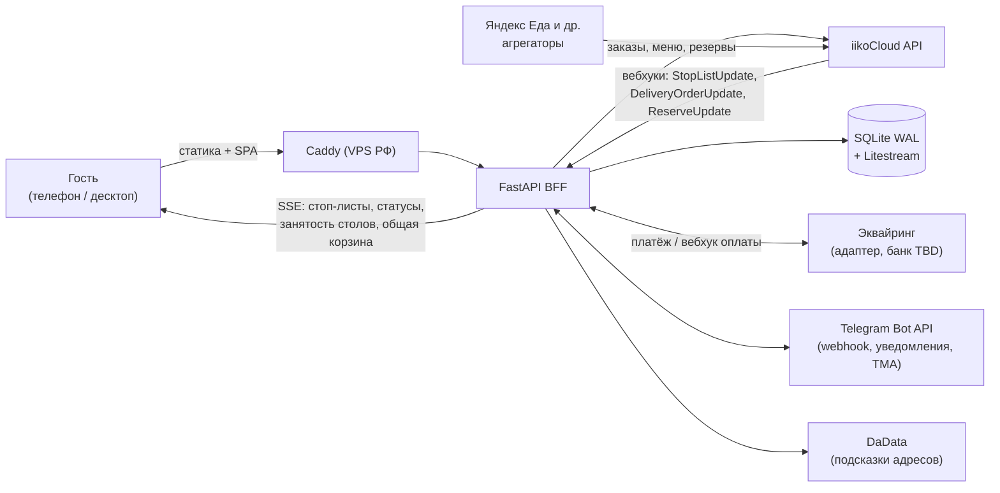

# Архитектура

Документ фиксирует договорённости по состоянию на 2026-07-08.
Каждый блок дополнительно обсуждается перед реализацией; изменения вносим
сюда же, чтобы документ оставался актуальным источником решений.

## 1. Принципы

1. **iiko — единственный источник правды** по данным ресторана: меню, цены,
   стоп-листы, заказы, столы, резервы, лояльность. Сайт ничего из этого не
   ведёт у себя — только читает, кэширует и отправляет.
2. **Максимум автоматизации в iiko.** Всё, что можно редактировать в iiko
   (меню, фото и описания блюд через внешнее меню, комбо, акции,
   стоп-листы), редактируется там. Персонал работает в одной системе.
   Админка сайта — минимальная, только для того, чего в iiko нет.
3. **Тонкая серверная прослойка (BFF), а не «бэкенд с бизнес-логикой».**
   Сервер обязателен по трём причинам, которые нельзя обойти: ключ iiko API
   нельзя светить в браузере; вебхукам iiko нужен постоянный endpoint;
   платёжным колбэкам эквайринга — тоже.
4. **QR-меню = режим сайта, а не отдельный продукт.** Один каталог, одна
   корзина, один код — три канала продаж (доставка, самовывоз, за столом).
5. **Mobile-first.** Дизайн и вёрстка проектируются от экрана телефона
   (доставка заказывается с телефона, QR за столом — по определению
   с телефона). Десктоп — расширение вёрстки. Требование передаётся
   дизайнеру до начала макета.
6. **Минимальные требования к серверу.** Публичные страницы отдаются как
   статика, ресурсы сервера тратятся на обработку заказов, а не на рендер
   страниц. Минимум движущихся частей: без Redis, Postgres, очередей,
   Docker (опционально позже) и Kubernetes.
7. **Сменные адаптеры для внешних сервисов.** Эквайринг, провайдер кодов
   авторизации, карты — за интерфейсами, чтобы замена провайдера не
   трогала остальной код.

## 2. Стек

| Слой | Выбор | Почему |
|---|---|---|
| Бэкенд (BFF) | **FastAPI** (Python, async) | Прокси к iiko, вебхуки, SSE (`sse-starlette`), фоновые задачи (APScheduler, in-process). Рабочий стек команды — опыт эксплуатации важнее моды |
| Фронтенд | **Vite + React SPA + пререндер публичных страниц** | Интерактив (корзина, чекаут, карта зала) — SPA; SEO-страницы (~10–20 штук) пререндерятся в статический HTML при билде и по вебхуку. React — рабочий стек команды (решено 2026-07-08) |
| Типизация | Pydantic на бэке → OpenAPI → **сгенерированные TS-типы** на фронте (`openapi-typescript`, команда `make types`) | Общий контракт типов без монолита: поменял модель — фронт не соберётся, пока не поправишь (решено 2026-07-08) |
| БД | **SQLite (WAL)** + **Litestream** (непрерывный бэкап в S3-совместимое хранилище) | Профиль нагрузки: сотни заказов/день = единицы записей в минуту. Хранится только то, чего нет в iiko. Переход на Postgres — только если появится сеть точек с конкурентной записью (SQLAlchemy делает миграцию безболезненной) |
| Веб-сервер | **Caddy** (авто-HTTPS) + **systemd** | Docker Compose — опционально позже, если появится боль; systemd легче по ресурсам |
| Хостинг | **VPS в РФ**, ~2 vCPU / 2 ГБ | Латентность для гостей + 152-ФЗ (телефоны, адреса). Выбор VPS — по CPU/RAM/NVMe, а не по «MySQL в комплекте» (MySQL не нужен) |
| Real-time | **SSE** (Server-Sent Events), не WebSocket | Проще, дешевле, работает через любой прокси, автопереподключение бесплатно |

Отклонённые варианты (чтобы не возвращаться): Next.js-монолит (SSR-сервер
прожорлив по памяти на self-hosted, выгоды заточены под Vercel; SEO кафе
закрывается пререндером и карточками Яндекс Бизнес/2ГИС), готовые CMS
(тяжело, негибко), Postgres/Redis/очереди на старте (нет нагрузки, которая
их оправдывает).

## 3. Схема компонентов



Заказы агрегаторов попадают в iiko напрямую (интеграция на стороне iiko,
сайт не участвует) — но учитываются в нашем расчёте загрузки кухни,
потому что мы видим все активные заказы iiko.

## 4. Интеграция с iiko

- **Тариф: Pro** — включает API для интеграций, iikoCard (лояльность),
  резервирование столов, QR-меню, iikoWaiter. С 01.07.2025 iikoCard, API и
  хостинг входят в тарифы облачной версии, отдельно не докупаются.
- Доступ появится ~через месяц (от 2026-07-08). У дилера запросить:
  **apiLogin для iikoCloud API**, подтверждение доступности **вебхуков**
  и **внешнего меню**.
- **Одна точка сейчас, возможна сеть**: `organizationId` — конфигурируемый
  список с одним элементом, расширение до сети не потребует переделки.

Используемые механизмы API:

| Задача | Механизм iiko |
|---|---|
| Меню с витринным контентом | **Внешнее меню** (`api/2/menu`): витринное название, описание, фото, аллергены, теги, КБЖУ, цена — редактируется персоналом в iikoWeb |
| Картинки блюд | Скачиваются и кэшируются **локально** (не хотлинк с CDN iiko): быстрее, независимее, свои размеры под мобилку |
| Стоп-листы | Вебхук `StopListUpdate` → SSE всем открытым клиентам + перегенерация пререндеренных страниц. Задержка — секунды |
| Заказ на доставку | `createDelivery` + проверка адреса по зонам на стороне iiko при создании |
| Статусы заказов | Вебхук `DeliveryOrderUpdate` → живой трекер по SSE |
| Бронь столов | `reserve/available_restaurant_sections` (схема залов со столами и координатами) + вебхук `ReserveUpdate` → живая карта зала |
| Заказ за столом | Привязка столов к QR-ссылкам; заказ уходит в iiko с указанием стола |
| Лояльность | iikoCard (фаза 3) |
| Комбо, акции | Настраиваются в iiko (Pro включает продвинутую лояльность) |

Организационное требование (не техническое): хостес обязана вести брони
в iiko, иначе интерактивная карта зала врёт.

## 5. Платежи

- Интерфейс **`PaymentProvider` с заглушкой**; банк эквайринга заказчик
  уточнит позже. Адаптер под конкретный банк (Т-Банк / Сбер / ЮKassa /
  CloudPayments — модель у всех одинаковая: создать платёж → редирект или
  СБП → вебхук об оплате) пишется без изменения остального кода.
- Оплата в QR-меню за столом — это **обычный интернет-эквайринг**, не
  терминал: гость на своём телефоне жмёт «Оплатить счёт» → СБП-deeplink
  (открывает банковское приложение) или форма карты эквайрера.
- Чек по 54-ФЗ формирует эквайринг/онлайн-касса; в iiko заказ закрывается
  типом оплаты «онлайн» — официант видит оплату на терминале/в iikoWaiter.
- Один платёжный модуль обслуживает доставку, самовывоз и стол.
- ⚠️ **Риск для песочницы:** корректное закрытие заказа в iiko несколькими
  внешними платежами через API (нужно для split-оплаты) — проверить первым
  делом после получения доступа.

## 6. Адреса, зоны доставки, карты

Схема, при которой лимиты внешних API перестают быть риском:

1. **Ввод адреса** — подсказки **DaData** (бесплатно до 10 000
   запросов/день; один адрес ≈ 10–30 запросов → ~400–500 адресов в день
   бесплатно — хватает с запасом).
2. **Проверка зоны** — DaData возвращает координаты; попадание точки
   в полигон зоны считаем **сами на сервере** (point-in-polygon), ноль
   внешних запросов. Дублируется проверкой на стороне iiko при создании
   заказа.
3. **Отображение карты зон** (только страница «Доставка») — Яндекс JS API
   (бесплатный лимит 25 000/сутки, с мая 2025 тарифы JS API и Геокодера
   разделены) или Leaflet + OSM бесплатно. Финальный выбор — при
   реализации.

## 7. Авторизация гостей

- **Гостевой чекаут — всегда доступен**, заказ без регистрации — святое.
- Авторизация — мягкая, по номеру телефона, предлагается после первого
  заказа («сохранить историю»). Нужна для: истории заказов, повтора
  в 1 клик, бонусов лояльности.
- Каналы кода подтверждения (сменный адаптер, финальный выбор в процессе):
  **flash-call** (звонок-сброс, код = последние 4 цифры номера, ~0,3–1 ₽)
  как основной + **Telegram Gateway** (~$0.01) как альтернатива.
  **SMS не используем** (4–8 ₽ за штуку) — как минимум на старте.

## 8. Структура сайта (карта страниц)

```
Публичная часть (пререндер, статика)
├── /                     Главная: хиты, акции, «повторить прошлый заказ»
├── /menu                 Меню (категории из iiko, фильтры, поиск)
│   └── /menu/[dish]      Блюдо: фото, состав, КБЖУ, аллергены, модификаторы
├── /promo                Акции и новости (возможно, зеркало TG-канала — см. открытые вопросы)
├── /booking              Бронь стола (интерактивная карта зала)
├── /delivery             Условия: карта зон, время, оплата
├── /about  /contacts     О кафе, контакты, реквизиты

Транзакционный флоу (SPA)
├── /cart                 Корзина (единая для всех режимов)
├── /checkout             Чекаут: доставка / самовывоз ко времени / за столом
├── /order/[id]           Живой трекер: принят → готовится → в пути/готов

Режим «за столом»
├── /t/[tableCode]        То же меню в контексте стола + общая корзина стола
│                         + вызов официанта + счёт + оплата

Личный кабинет
├── /account              История, повтор в 1 клик, адреса, бонусы

Служебное
├── /admin                Мини-админка: только то, чего нет в iiko
│                         (баннеры, тонкие настройки витрины, новости —
│                         если не TG-зеркало)
└── /api/...              BFF: прокси к iiko, вебхуки iiko и эквайринга,
                          вебхук Telegram, SSE-стримы
```

## 9. Эксплуатационные затраты

Принцип (зафиксирован 2026-07-08): **минимизация затрат на поддержание —
топ-1 приоритет; всё платное и подписочное — только по согласованию.**
Весь стек — open-source, лицензий и подписок в коде нет.

| Статья | Стоимость | Характер |
|---|---|---|
| VPS (РФ, 2 vCPU / 2 ГБ) | ~500–1500 ₽/мес | Обязательная, единственная регулярная |
| Домен .ru | ~300–900 ₽/год | Обязательная |
| HTTPS-сертификат | 0 ₽ (Let's Encrypt через Caddy) | — |
| SQLite, FastAPI, React и весь стек | 0 ₽ | Open-source |
| DaData (подсказки адресов) | 0 ₽ до 10 000 запросов/день (~400–500 адресов/день) | Бесплатного лимита кафе хватает с запасом |
| Карта зон (Leaflet + OSM) | 0 ₽ | Яндекс.Карты — только если захотим, тоже в бесплатном лимите |
| Telegram Bot API / Mini App | 0 ₽ | — |
| Бэкапы (S3-совместимое хранилище) | ~0–150 ₽/мес | Объём БД крошечный |
| flash-call (коды авторизации) | ~0,3–1 ₽ за код, без подписки | Оплата за факт использования |
| Эквайринг | % с оборота по договору заказчика с банком | Не наша статья, подписки нет |
| Apple Developer (Wallet-карты) | $99/год | **Только по согласованию**, фаза 3, для Google Wallet не нужен |
| iiko (тариф Pro) | оплачивается заказчиком и так | API и iikoCard входят в тариф |

Итого регулярных затрат на сайт: **VPS + домен, порядка 700–1600 ₽/мес.**
Новые платные сервисы в проект не добавляются без явного согласования.

## 10. Деплой и эксплуатация

Готовая обвязка — в каталоге [`deploy/`](../deploy/README.md): скрипт
настройки чистого VPS (`setup.sh домен.ru`), скрипт обновления
(`update.sh`), systemd-юнит, Caddyfile, шаблон Litestream.

- VPS в РФ (~2 vCPU / 2 ГБ), один Python-процесс под systemd, Caddy
  с авто-HTTPS.
- SQLite-файл + Litestream → непрерывная репликация в S3-совместимое
  хранилище (восстановление в одну команду).
- Пререндер публичных страниц: при билде + точечная перегенерация по
  вебхукам (стоп-лист, изменение меню).
- Фоновые задачи (синк меню, пересчёт ETA, кэш картинок) — APScheduler
  внутри процесса, без внешних воркеров.
- Docker Compose — добавим позже только при реальной необходимости.
